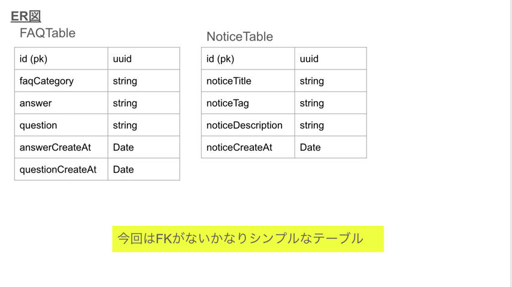
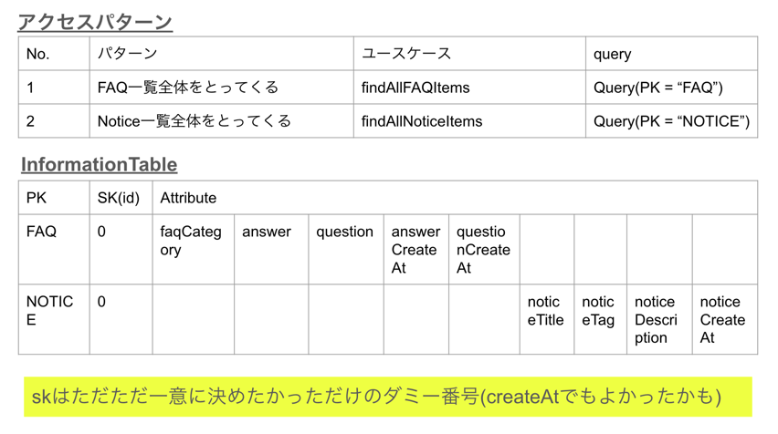

# DynamoDB✖️SpringBoot（Kotlin）

目次

- [今回のシステム概要図](#今回のシステム概要図)
- [informationTable設計](#informationTable設計)
- [参考](#参考)

# 今回のシステム概要図

 システム概要図

# informationTable設計

 1. RDSと同様にER図を考える

 2. アクセスパターンを考えて、全てを網羅できるテーブルを考える

# 参考

[Dynamo設計のQuita](https://qiita.com/_kensh/items/2351096e6c3bf431ff6f)

